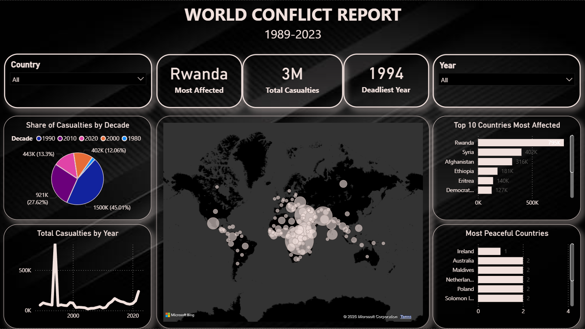
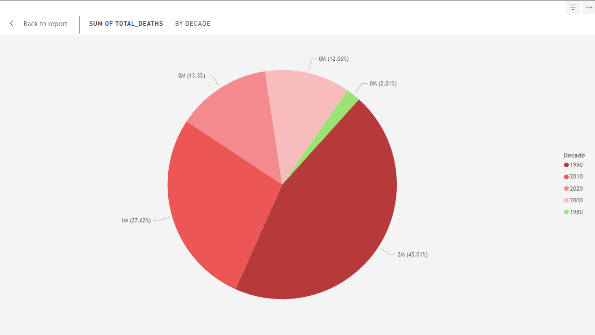
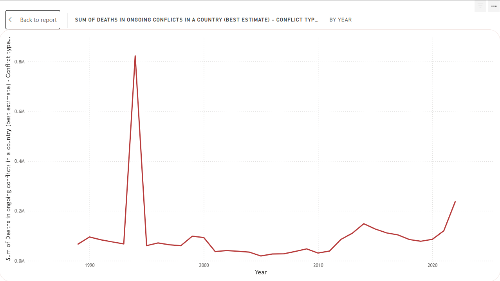
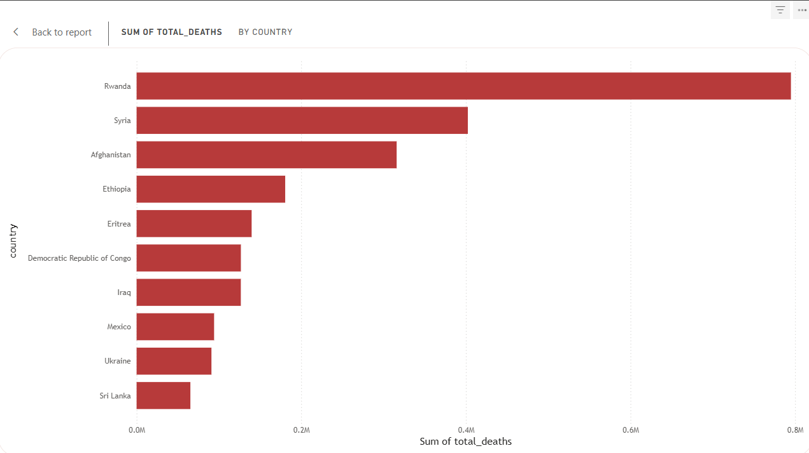
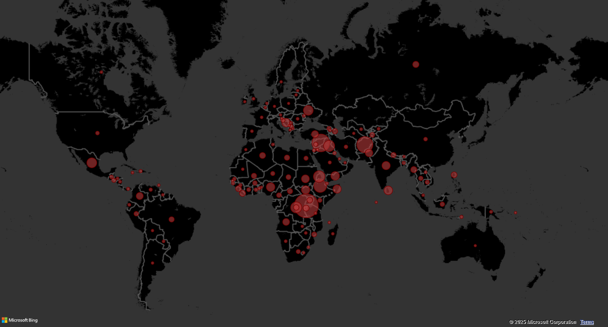
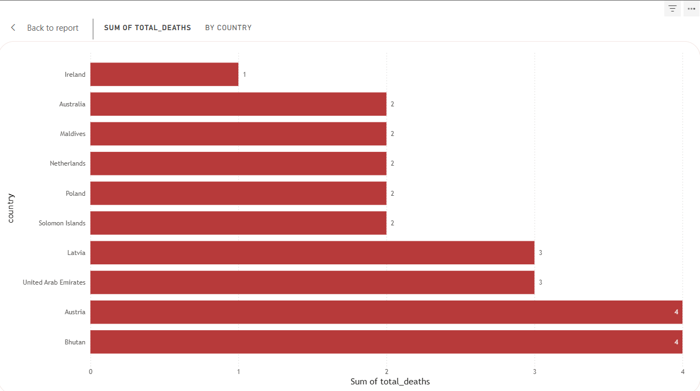

# 🌍 Global Conflict Analysis Dashboard (1989–2023)




### 📖 Overview

This project explores global conflicts between 1989 and 2023 using a dataset of 10,000+ rows. The goal was to clean, analyze, and visualize historical conflict data to uncover patterns of violence, hotspots, and peace over the past 35 years.

By combining my Political Science background with data analytics tools, I demonstrate how data can tell powerful stories about war, peace, and human resilience.

### 🎯 Objectives

- Clean and prepare raw conflict data for analysis.

- Perform exploratory data analysis (EDA) using SQL.

- Build interactive Power BI dashboards for insights.

- Identify most affected regions, deadliest years, and peaceful countries.

- Showcase the ability to work with real-world, large datasets (10k+ rows).

### 🛠 Tools Used

- **Excel →** Data cleaning & preprocessing.

- **SQL (PostgreSQL) →** Exploratory data analysis.

- **Power BI →** Interactive dashboard & visualizations.

- **GitHub →** Documentation & version control.

### 📊 Dataset

Name: Countries in Conflict (1989–2023)

Size: ~10,000 rows

**Columns:**

- Country

- Country Abbreviation

- Year

- Deaths in ongoing conflicts in a country (best estimate)


### 🔍 Data Cleaning & Preparation

- Loaded dataset into Excel

- Removed duplicates

- Standardized country names

- Checked for missing values

### SQL Queries for EDA

- Total deaths per year

- Top 10 deadliest years

- Top 10 most affected countries

- Deadliest decades

- Most peaceful countries (excluding 0-death countries)

Sample Query (Top 10 Deadliest Years):


```SQL
SELECT 
    year,
    SUM(deaths) AS total_deaths
FROM world_conflicts
GROUP BY year
ORDER BY total_deaths DESC
LIMIT 10;
```

### 📈 Dashboard Contents
🔹 Key Metrics (KPI Cards)

**Most Affected Country:** Rwanda (1.2M+ deaths)

**Deadliest Year:** 1994 (82K deaths)

**Total Casualties:** 3M+ deaths

🔹 Visuals

### Pie Chart → Deaths by Decade



**1990s emerge as the deadliest decade.**

### Line Chart → Year-on-Year Deaths



***Sharp spike in 1994 (Rwandan Genocide).***

### Bar Chart → Top 10 Most Affected Countries



***Rwanda, Sudan, Iraq, Afghanistan in top ranks.***

### Map → Global Distribution of Conflicts



***Africa most concentrated, followed by Middle East.***

### Card → Most Peaceful Country



***Ireland (1 death recorded).***

### 📌 Insights

- Conflicts peaked in the 1990s, largely due to African civil wars and genocides.

- 1994 was the deadliest single year, with over 82,000 deaths, mostly from Rwanda.

- Rwanda was the most affected country overall (1.2M+ deaths).

- Ireland ranked as one of the most peaceful, with only 1 recorded death.

- Africa and the Middle East remain long-term conflict hotspots.

### 📚 Learning Outcomes

- Applied ETL (Extract, Transform, Load) pipeline: cleaning in Excel, analyzing in SQL, visualizing in Power BI.

- Strengthened data storytelling skills by linking trends to historical events (Cold War aftermath, Rwandan genocide, Iraq war).

- Built an end-to-end analytics project to demonstrate job-ready data skills.

👨‍💻 Author

Debajyoty Sen

📍 Cooch Behar, West Bengal, India

🔗 [LinkedIn](https://www.linkedin.com/in/debajyoty-sen/)

📧 sendebajyoty@gmail.com